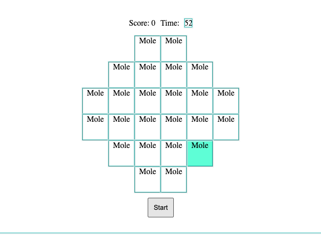

# Whac-a-Mole Game

Simple Whac-a-Mole Game!!!
This interactive game features 24 mole houses arranged as depicted below (bad styling alert!). The moles pop up randomly and will be visible through the background color. The players can gain points by clicking on the active moles as they appear. The game spans a duration of 60 seconds.



## User Story

- The player initiates the game by hitting the 'start' button, which triggers the moles to appear randomly.
- A countdown timer is displayed, starting from 60 seconds.
- Players accumulate points by clicking on active moles, incrementing the score.
- The game ends once the countdown reaches zero.
- To play again, simply hit the 'start' button again.

# Installation

1. Download the game
2. Run `npm install` to install.
3. To run the tests, run `npm test`.

## 1. Game Development Breakdown

To above repetition and re-renders. As such, I broke the game down into several components:

1. Main component/page - Game Board the App page.
2. Mole component - Multiple instances required
3. Game Logic Handler - A component that manages all the game logic
4. Time component - This has be be a standalone component ad it needs to re-render every second

#### 2. Game Board Design

The gmae board is made up of 24 mole houses.I used an array containing subarrays to create rows, which are displayed using "flex".

```html
<div>
  <div className="row">
    <div></div>
  </div>
  <div className="row">
    <div></div>
    <div></div>
    <div></div>
    <div></div>
  </div>
  <div className="row">
    <div></div>
    <div></div>
    <div></div>
    <div></div>
    <div></div>
    <div></div>
  </div>
  .....
</div>
```

**Note:** The current version is not responsive

#### 3. Mole Component

Each mole component can be distinguished through index and only if the moles[index] is true, it increment the score in the state and set the mole false but if the mole[indix] is already false it doens't do anything.

Each Mole component is unique and can be identified through its index. If the moles[index] is "true" (meaning it's currently visible), clicking on it will increase the player's score and make that mole disappear. However, if the mole is already "false" (not visible), clicking on it doesn't have any effect.

```jsx
function handleClick(index: number) {
  if (moles[index]) {
    setScore((prev) => prev + 1);
    setMoles((prev) => {
      const prevMolesState = [...prev];
      prevMolesState[index] = false;
      return prevMolesState;
    });
  }
}
```

#### 3.Game Initiation

The game begins when the 'start' button is clicked, triggering a state change in isStarted from false to true and thus loading the Game component.

```jsx
<button
  className="start"
  onClick={() => {
    localStorage.removeItem("time");
    setIsStarted(true);
  }}
>
  {isStarted && <Game moles={moles} setMoles={setMoles} />}
  Start
</button>
```

### 4. Timer Functionality

On clicking the 'start' button and the change of isStarted state to true, the Time component loads. This component requires its own render, as it needs to update and display the current remaining time every second.
.

#### 5. Game Conclusion

The timer component uses the useTimer hook, where the countdown logic resides. This hook accepts a callback function and delay value as arguments. As it loads, it triggers the handleTimer function every second using setInterval. It also monitors the time state and saves the current time value in local storage. Once the countdown hits zero, the callback function executes, calling setIsStarted with false.

#### 6. Game Functionality

The Game component handles generating random moles and updating the moles state. Upon loading, it executes the generateAndUpdateRandomMole function every 1000ms. This function checks if there are more than 5 active moles. If not, it generates a random index number smaller than the moles array length, and updates the corresponding mole state to true. It also toggles the state back to false after 1-3 seconds to maintain

#### 9. Clean Up Process

When a component is dismounted or removed, the timers (setTimeout, setInterval) are cancelled to prevent them from continuing to run in the background.
